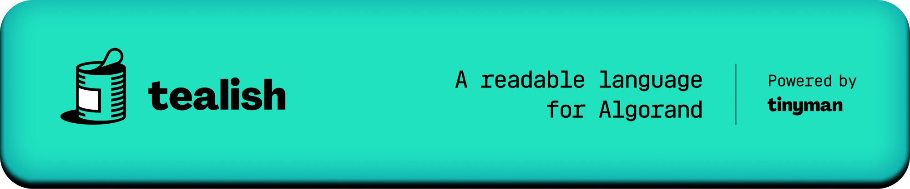

.. Tealish documentation master file, created by
   sphinx-quickstart on Wed Nov 16 21:10:38 2022.
   You can adapt this file completely to your liking, but it should at least
   contain the root `toctree` directive.

Tealish is a readable language for the Algorand Virtual Machine. It enables developers to write TEAL in a procedural style optimized for readability.

Minimal Example
---------------

A simple example demonstrating assertions, state, if statements and inner transactions:

.. literalinclude:: ../examples/counter_prize/counter_prize.tl

Installing
----------

``pip install tealish``

Usage
-----
``tealish compile example.tl``

.. toctree::
   :maxdepth: 2
   :caption: Contents:

   quick_start
   language
   examples
   cli
   recipes
   questions
   zen

Indices and tables
==================

* :ref:`genindex`
* :ref:`modindex`
* :ref:`search`
